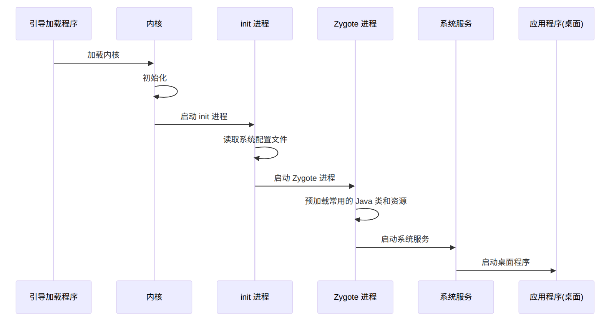

# Android系统启动流程



1. **引导加载程序（BootLoader）** ：当设备通电后，首先会由引导加载程序启动。引导加载程序通常储存在设备固件中，它的主要任务是初始化硬件，并加载启动操作系统内核。
2. **Linux内核**：Android系统是基于Linux内核构建的，加载程序会根据预定义的配置从设备储存中加载Linux内核到内存中的指定位置，并将控制权交给内核。内核开始执行初始化过程，初始化硬件，文件系统；创建init进程等
3. **init进程**：内核初始化完成之后，会启动名为init的用户空间进程。init进程（pid=1）是Android系统中的第一个用户空间进程，他会解析初始化脚本文件（例如：init.rc），根据其中的指令来启动对应的系统服务，fork出Zygote进程等
4. **Zygote进程**：init进程启动后会fork出Zygote进程，Zygote进程是Android应用程序的孵化器，它会预加载常用的java类和资源信息通过 `fork()` 快速创建新进程，共享已加载的代码和资源。同时启动system_server， 做完这些后Zygote会执行循环等待消息创建新的进程
5. **系统服务（system_server）** ：system_server进程由Zygote进程孵化，是Android系统中最核心的进程，承载了几乎所有的系统服务，例如ActivityManager，WindowsManager，PackageManager等；这些系统服务负责管理系统的各个方面
6. **应用程序**：系统服务启动完成，Android系统就处于可用状态，就会启动桌面应用（Launcher），此时用户可以看到桌面程序并可以进行交互了

　　‍

## 1. Zygote进程

### 1.1 Zygote进程简介

- zygote是一个用户进程，由init进程fork而来
- zygote进程的主要任务是加载系统的核心类库（如java核心库和Android核心库），启动system_server进程，然后进入循环等待请求来创建新的Android应用进程
- zygote通过 `fork()` 快速创建新进程，共享已加载的代码和资源

　　‍

### 1.2. Zygote进程的创建

#### 1.2.1 init.rc文件

　　	zygote进程由init进程创建，init进程是Linux系统中的第一个用户空间进程，他通过解析init.rc文件来启动各种服务进程，init.rc包含zygote启动的主要代码

```c
// 创建zygote服务
// service zygote: 定义了一个名为zygote的服务
// /system/bin/app_process：这是启动zygote进程的可执行文件
// -Xzygote：标志这是一个zygote进程启动的特殊模式
// /system/bin：指定进程的工作目录
// --zygote：告诉app_process以Zygote模式启动。
// --start-system-server：Zygote启动时还要启动System Server进程，这是Android系统中管理关键系统服务的核心进程。
service zygote /system/bin/app_process -Xzygote /system/bin --zygote --start-system-server
// 将zygote服务归类为main类别，Android系统在启动过程中会启动所有"main"类别的服务
class main
// 创建zygote socket， 与系统和应用程序做交互
socket zygote stream 660 root system
// 定义了zygote服务重启时的一些操作
onrestart write /sys/android_power/request_state wake
onrestart write /sys/power/state on
onrestart restart media
onrestart restart netd
```

　　‍

#### 1.2.2 app_process 文件

　　	/system/bin/app_process是Android中的一个关键可执行文件，负责启动Zygote进程和应用进程。它的主入口点是main方法，一下是关键代码说明

```c
int main(int argc, char* const argv[])
{
    // 创建并初始化AppRuntime对象runtime
    AppRuntime runtime(argv[0], computeArgBlockSize(argc, argv));
    
    // 初始化参数zygote,startSystemServer,application,niceName,className
    // 代码见源码，此处略
    
    // 解析命令行参数
    // 代码见源码，此处略
 
    // 构建传递给 Java 初始化类的参数列表
    // 代码见源码，此处略
    if (zygote) {
        // 调用AppRuntime的start方法，开始加载ZygoteInit类
        runtime.start("com.android.internal.os.ZygoteInit", args, zygote);
    } else if (!className.isEmpty()) {
        runtime.start("com.android.internal.os.RuntimeInit", args, zygote);
    } else {
        fprintf(stderr, "Error: no class name or --zygote supplied.\n");
        app_usage();
        LOG_ALWAYS_FATAL("app_process: no class name or --zygote supplied.");
    }
}
 
```

　　‍

#### 1.2.3 AppRuntime 类（AndroidRuntime）

　　	AppRuntime继承自AndroidRuntime(ART)，是Android中的一个关键类，负责管理和启动Android应用程序或系统服务的java虚拟机

　　	app_process的main方法调用了AppRuntime的start()方法，也就是AndroidRuntime的start方法

```c++
void AndroidRuntime::start(const char* className, const Vector<String8>& options, bool zygote)
{
    // 初始化Java Native Interface (JNI)。JNI是Java和C/C++之间的接口，它允许Java代码和C/C++代码相互调用
    JniInvocation jni_invocation;
    jni_invocation.Init(NULL);
    
    JNIEnv* env;  // JNIEnv环境指针
    // 初始化虚拟机
    if (startVm(&mJavaVM, &env, zygote, primary_zygote) != 0) {
        return;
    }
 
    // 注册JNI方法
    if (startReg(env) < 0) {
        return;
    }
 
    /*
     * 以下代码执行后，当前线程（即运行 AndroidRuntime::start 方法的线程）将成为Java虚拟机（JVM）的主线程，并且在调用env->CallStaticVoidMethod启动指定的Java类的 main 方法后，这个方法不会返回，直到 JVM 退出为止。(官方文档说明)
     */
    
    // 将"com.android.internal.os.ZygoteInit"转换为"com/android/internal/os/ZygoteInit"
    char* slashClassName = toSlashClassName(className != NULL ? className : "");
    jclass startClass = env->FindClass(slashClassName);
    if (startClass == NULL) {
        // 没有找到ZygoteInit.main()方法
    } else {
        // 通过JNI调用ZygoteInit.main()方法
        jmethodID startMeth = env->GetStaticMethodID(startClass, "main",
            "([Ljava/lang/String;)V");
    }
}
```

　　‍

#### 1.2.4 ZygoteInit类

　　	在AndroidRuntime的start方法中， 通过jni调用了ZygoteInit.main()，系统第一次进入了java层（ZygoteInit是Android系统运行的第一个java类），通过main方法完成资源预加载，启动系统服务等功能

```java
public static void main(String[] argv) {
    // 创建ZygoteServer
    ZygoteServer zygoteServer = null;
    ...
    // 预加载资源
    preload(bootTimingsTraceLog);
    ...
    // 初始化ZygoteServer
    zygoteServer = new ZygoteServer(isPrimaryZygote);
    ...
    // 通过fork的形式初始化SystemServer
    Runnable r = forkSystemServer(abiList, zygoteSocketName, zygoteServer);
    if (r != null) {
        r.run();
        return;
    }
    ...
    // 启动Loop，监听消息
    caller = zygoteServer.runSelectLoop(abiList);
    ...
}
```

　　	通过preload()方法预加载系统常用的类，资源和库，能显著减少应用启动时的延时，并通过共享这些预加载的内容来降低内存使用提高系统性能

```java
static void preload(TimingsTraceLog bootTimingsTraceLog) {
    preloadClasses(); //加载常用的Java类（如Activity、Service、BroadcastReceiver等）
    preloadResources(); //加载常用的资源（如布局、图片等）
    preloadOpenGL(); //加载OpenGL库
    preloadSharedLibraries(); //加载常用的本地共享库
    preloadTextResources(); //加载常用的文本资源
    ...
}
```

　　‍

#### 1.2.5 启动system_server

　　	在ZygoteInit的main方法中调用了`forkSystemServer`​方法，通过Zygote.forkSystemServer()执行实际的fork操作，然后调用handleSystemServerProcess()处理系统服务进程的初始化，最终执行`SystemServer`类的main方法完成服务启动

```java
private static Runnable forkSystemServer(String abiList, String socketName,
            ZygoteServer zygoteServer) {
	...
			//fork进程
            pid = Zygote.forkSystemServer(
                    parsedArgs.mUid, parsedArgs.mGid,
                    parsedArgs.mGids,
                    parsedArgs.mRuntimeFlags,
                    null,
                    parsedArgs.mPermittedCapabilities,
                    parsedArgs.mEffectiveCapabilities);

        if (pid == 0) {
            if (hasSecondZygote(abiList)) {
                waitForSecondaryZygote(socketName);
            }

            zygoteServer.closeServerSocket();
			//完成服务启动最终调用到SystemServer类的main方法
            return handleSystemServerProcess(parsedArgs);
        }
}
```

　　‍

#### 1.2.6 Zygote进入循环

　　	在完成system_server的创建之后，调用了zygoteServer.runSelectLoop()进入循环，等待消息创建新的进程， 至此完成整个了Zygote的初始化流程

　　‍

## 2. System Server进程

　　	system server是Android系统中的关键进程，负责启动和管理核心系统服务

### 2.1 SystemServer类

　　	在`SystemServer.java`​的`main`​方法调用了自身的`run`方法，在run方法中启动了具体的系统服务，代码如下：

```java
public static void main(String[] args) {
    new SystemServer().run();
}
 
private void run() {
    // 初始化系统属性，时区、语言、环境等，代码略
    ...
    // 加载本地服务
    System.loadLibrary("android_servers");
    ...
    // 初始化系统上下文
    createSystemContext();
    // 初始化主线模块
    ActivityThread.initializeMainlineModules();
    ...
    // 创建系统服务管理器
    mSystemServiceManager = new SystemServiceManager(mSystemContext);
    ...
 
    /* 启动系统服务 */
    // 启动引导服务
    startBootstrapServices(t);
    // 启动核心服务
    startCoreServices(t);
    // 启动其他服务
    startOtherServices(t);
    // 启动 APEX 服务
    startApexServices(t);
    ...
}
```

　　‍

### 2.2 System Server的主要服务

|服务名称|功能说明|
| -------------------------------------| --------------------------------------------------------------------------|
|Activity Manager Service (AMS)|管理应用程序的生命周期，包括启动和停止应用、管理任务和活动栈、处理广播等|
|Package Manager Service (PMS)|管理应用包的安装、卸载、更新、权限分配等|
|System Config Service|管理系统配置和资源|
|Power Manager Service|管理设备的电源状态和电源策略，如休眠、唤醒等|
|Display Manager Service|管理显示设备，如屏幕亮度、显示模式等|
|User Manager Service|管理用户账户和用户信息|
|Battery Service|监控和管理电池状态和电池使用情况|
|Vibrator Service|控制设备的振动功能|
|Sensor Service|管理设备的传感器，如加速度计、陀螺仪等|
|Window Manager Service (WMS)|管理窗口和显示内容，包括窗口的创建、删除、布局等|
|Input Manager Service|管理输入设备，如触摸屏、键盘等|
|Alarm Manager Service|提供定时任务调度功能|
|Connectivity Service|管理网络连接，如 Wi-Fi、移动数据等|
|Network Management Service|管理网络接口和网络连接|
|Telephony Registry|管理电话和短信服务|
|Input Method Manager Service (IMMS)|管理输入法框架|
|Accessibility Manager Service|管理无障碍服务，为有特殊需要的用户提供辅助功能|
|Mount Service|管理存储设备的挂载和卸载|
|Location Manager Service|管理位置服务，如 GPS 和网络定位|
|Search Manager Service|管理系统搜索功能|
|Clipboard Service|管理剪贴板功能|
|DevicePolicy Manager Service|管理设备的安全策略和企业管理功能|
|Status Bar Service|管理状态栏显示和操作|
|Wallpaper Manager Service|管理壁纸设置和操作|
|Media Router Service|管理媒体设备路由|

　　在启动服务全部启动完成之后，就开始启动系统桌面程序Launcher，用户看到桌面内容并可以进行操作了

　　‍

## 总结：

　　	通过上述介绍，从用户按下电源键开始，经过Bootloader启动、内核启动、init进程启动、Zygote进程启动、SystemServer进程启动，以及系统应用的启动，最终进入桌面环境。

　　每个阶段的核心工作：

1. **BootLoader启动：** 初始化硬件并加载Linux内核
2. **内核启动：** 初始化内核并创建init进程
3. **init进程启动：** 通过解析init.rc文件内容来启动系统服务
4. **Zygote进程启动：** Zygote是Android系统独有的设计，负责创建引用进程。通过预加载资源和共享内容，大大提高了应用的启动速度和系统资源利用率
5. **system server进程启动：** SystemSever进程启动了大量系统服务。这些服务构成了Android系统的骨干，管理和协调应用的运行
6. **应用启动：** Launcher应用的启动标志着系统启动的完成。用户进入桌面，可以开始正常使用设备。
